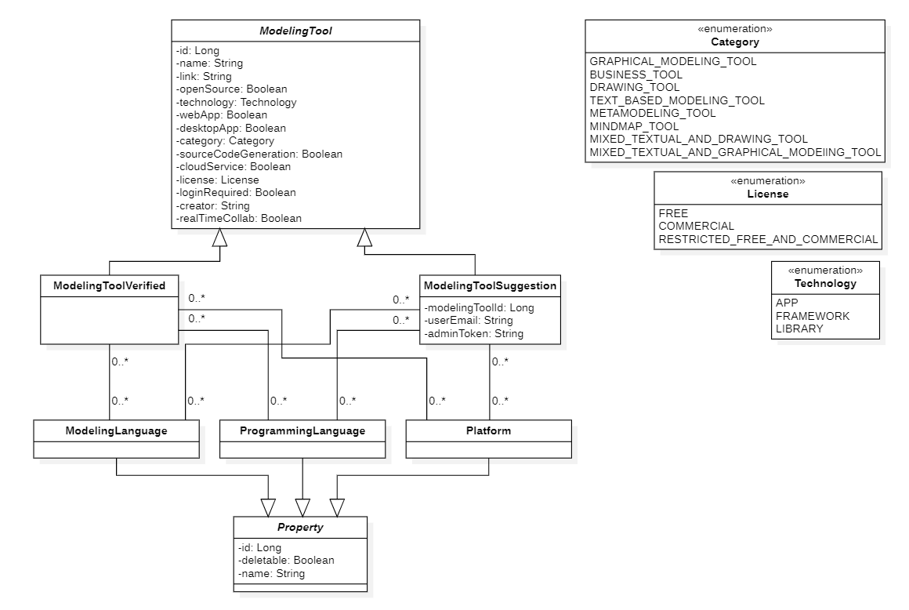
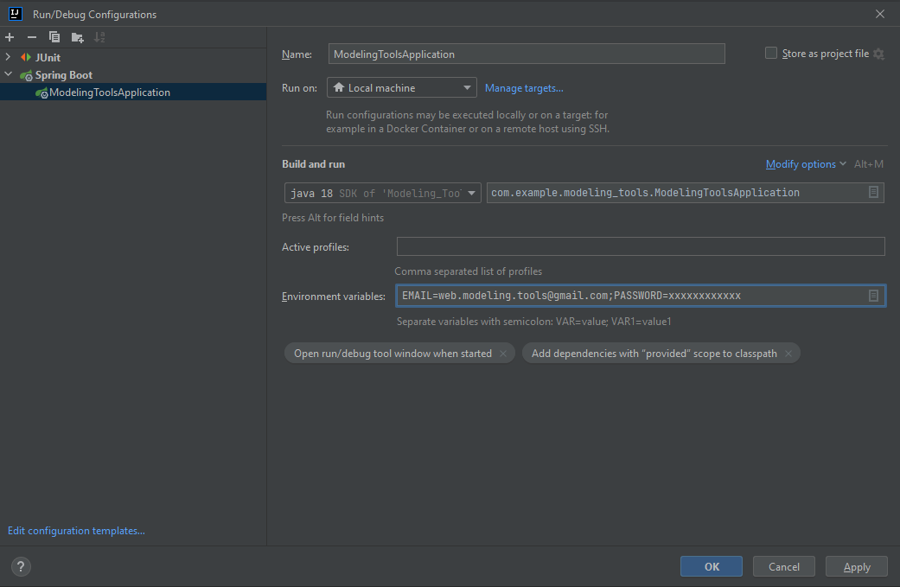
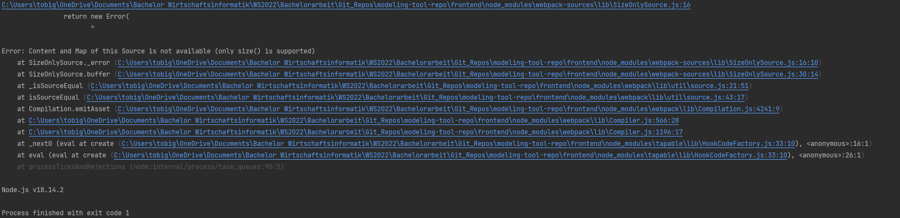
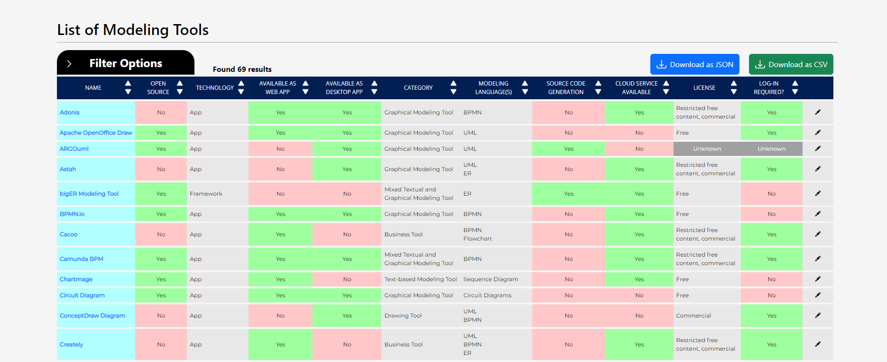

<!-- LOGO -->
<p align="center">
    
</p>

<!-- TITLE -->
<h1 align="center">Modeling Tool Website</h1>

**📖 Table of Contents**
1. [Overview](#overview)
2. [Technologies](#technologies)
3. [How to execute](#how-to-execute)
   1. [Backend](#backend)
   2. [Frontend](#frontend)
4. [Screenshots](#screenshots)

## Overview

The goal of this project is to present the currently available and active modeling tools. While there are already few 
other websites that provide this simple service, we also provide a clear overview in which aspects each of the modeling 
tools differ from each other.

Though some information is more available than other, we have also categorized each modeling tool based on its properties
and purposes, such as whether it is a pure modeling tool and thus more suited for engineers, or a drawing tool for 
regular users. More details are available the website.

<details>
   <summary>UML Class Diagram of the backend entities</summary>

   
</details>


## Technologies

<table>
    <tbody>
        <tr>
            <td>Programming Language</td>
            <td>Java OpenJDK 17</td>
        </tr>
        <tr>
            <td>Java-Framework</td>
            <td>Spring Boot 3.0.1</td>
        </tr>
        <tr>
            <td>JavaScript Runtime</td>
            <td>Node.js 18.x.x</td>
        </tr>
        <tr>
            <td>Frontend Framework</td>
            <td>Angular 14.x.x</td>
        </tr>
        <tr>
            <td>Database</td>
            <td>H2</td>
        </tr>
        <tr>
            <td>Test-Framework</td>
            <td>Junit 5.x.x</td>
        </tr>
        <tr>
            <td>Build & Dependency Management</td>
            <td>
                <div>Maven 3.x.x</div>
                <div>npm 9.x.x</div>
            </td>
        </tr>
        <tr>
            <td>Versioning</td>
            <td>Git</td>
        </tr>
    </tbody>
</table>


## How to execute

Open the backend folder and the frontend folder contained in the root folder separately.

### Backend

You can start the backend application through your command line or your IDE (e.g., Intellij).
To execute the backend through the command line, enter the following command:

```
mvn spring-boot:run
```

If you are executing the backend through Intellij, then the expected configurations should be already loaded. In that 
you can either press the 'Run' button, or enter ``Shift + F10``. Should the configurations not be automatically loaded,
then open the "Edit Configurations..." window and enter the following commands

<details>
   <summary>Edit Configurations Screenshot</summary>

   
</details>

If you want to have a functional Email Service, then you also need to specify your Email and Password within the file 
``backend/src/main/resources/application.properties`` under the properties

```
spring.mail.username=${EMAIL}
spring.mail.password=${PASSWORD}
```

To do so, either remove the dollar sign and curly brackets and enter the corresponding information, or do not edit the
file and instead open the "Edit Configurations..." window and enter your Email and Password as "Environment variable".

<details>
   <summary>Edit Configurations - Email and Password example</summary>

   
</details>

#### Tip

We strongly suggest that when specifying the email you use a Gmail account and generate an app password. Here's a link
to a video tutorial: https://www.youtube.com/watch?v=hXiPshHn9Pw&ab_channel=TweakLibrary


### Frontend

To execute the frontend, first go into the frontend folder within your command line and enter ``npm install``.
Afterwards, you can run the angular application with the command ``ng serve`` or with your IDE.

If you happen to encounter the error after running your Angular application (e.g., with ``ng serve``) as shown in the 
screenshot below, simply delete the file ``frontend/.angular``, enter ``npm install`` and then ``ng serve``.

<details>
   <summary>Angular error</summary>

   
</details>

### Optional

To also have all links returned as an email functioning, replace all instances of http://localhost:4200 (find instances
in Intellij with ``Ctrl`` + ``Shift`` + ``F``) with the official link .


## Screenshots

Homepage - section "List of Modeling Tools"

